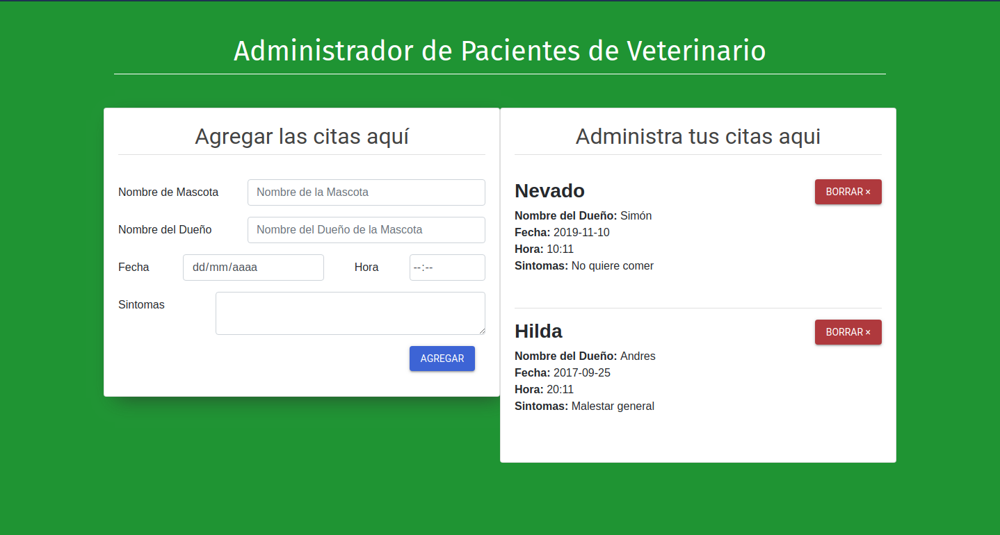

# Administrador de Pacientes de Veterinario

Aplicación desarrollada en ReactJS que se encarga de administrar las citas para consultas de un veterinario. Algunas de las features que tiene son:

* Utilización de Local Storage

## Scripts

* `npm install` para instalar las dependencias
* `npm run dev` para entorno de desarrollo
* `npm run build && npm start` para producción

**Nota**: en caso de no tener instalado el **serve** para correr el entorno de desarrollo, se puede instalar mediante el siguiente comando: `npm i --save serve` o `npm i -g server`

## Licencia

MIT

This project was bootstrapped with [Create React App]
(https://github.com/facebookincubator/create-react-app).
